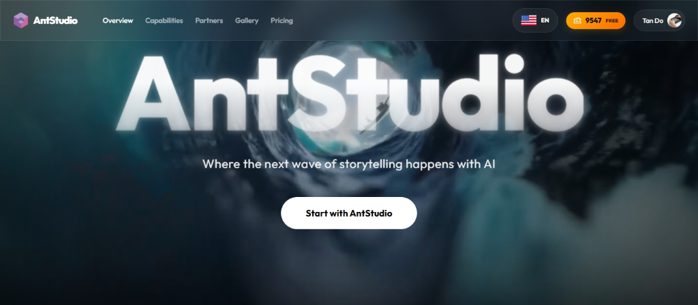
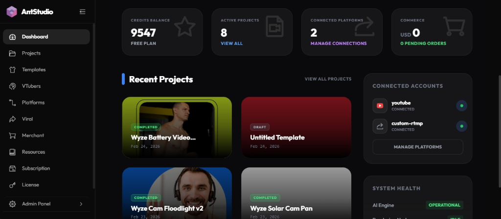
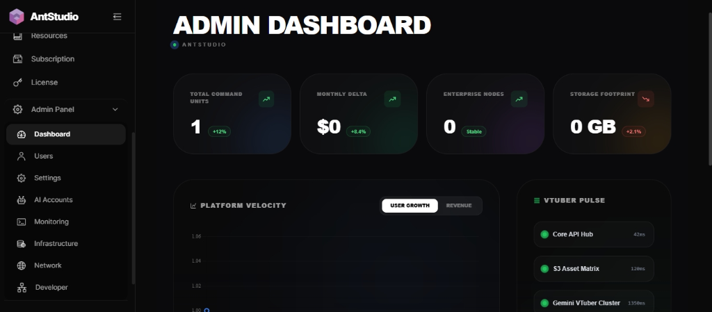

# AntStudio - Autonomous AI Streamer & Video Production Platform



> **AntStudio** is a state-of-the-art, fully autonomous AI Video Production & 24/7 Live Commerce Platform. Transform text prompts, digital avatars, product URLs, and camera feeds into high-converting video campaigns and non-stop live stream events.

[](https://opensource.org/licenses/AGPL-3.0)
[](https://nodejs.org/)
[](https://vuejs.org/)
[](https://www.typescriptlang.org/)
[](https://www.electronjs.org/)
[](https://www.mongodb.com/)
[](https://www.docker.com/)
[](https://github.com/dmtan90/AntStudio)

---

## 📸 Platform Showcase


*AntStudio Central Workspace Dashboard*


*Enterprise Management & Analytics Portal*

---

## 🎬 Specialized Production Workflows

AntStudio features 6 specialized AI production engines accessible via `ProjectCreationDialog.vue`:

1. ⚡ **Script-to-Video AI Engine (`ai-video`)**:
   - Generate full video storyboards, AI voiceovers, BGM, and animated subtitles automatically from text prompts or raw scripts.
2. 🎭 **AI Digital Avatars & Personas (`avatar`)**:
   - Create & customize 2D photo talking avatars, 3D VRM models, and Aidol video clips with Gemini voice synthesis and lip-sync.
3. 🛍️ **E-Commerce Product Ads Wizard (`product-ads`)**:
   - Paste any e-commerce product page URL to generate high-converting video ads with automated copy, voice, and graphic overlays.
4. 📡 **24/7 Autonomous Sale Studio (`sales-studio`)**:
   - Run non-stop live commerce streams with intelligent AI hosts, autonomous FSM product pitch loops, live Q&A, and scannable QR overlays.
5. 📹 **Screen & Camera Recorder Studio (`record`)**:
   - Capture webcam footage, desktop screens, presentation slides, and studio audio recordings with multi-track support.
6. 🎞️ **Multi-Track Canvas & Timeline Studio (`blank`)**:
   - Full-featured canvas video editor with multi-track video/audio timelines, transitions, and dynamic overlay rendering.

---

## 📡 24/7 Autonomous Sale Studio Architecture

The **24/7 Autonomous Sale Studio** is powered by `LiveSalesServiceV3`:

- 🔄 **Autonomous FSM State Machine**:
  - Automatically cycles through states (`GREETING` -> `PITCHING` -> `Q_AND_A` -> `CLOSING`) per product.
  - Broadcasts `studio:state_change` WebSocket directives directly to connected room clients (`socketServer.emitToRoom`).
- 🧠 **RAG-Grounded Product Pitching**:
  - Dynamically queries product specification vectors and knowledge bases before each pitch turn.
  - Cleans MongoDB ObjectIDs into human-readable product names in speech scripts.
- 💬 **Reactive Q&A Interception**:
  - Monitors viewer chat comments in real-time and pauses the storyboard loop to answer viewer questions instantly.
- 📱 **Dynamic QR & Urgency Overlays**:
  - Generates instant scannable checkout QR codes (<500ms) with real-time flash sale timer banners.
- ⚡ **Auto-Resilient Connection & Stream Relay**:
  - Built-in WebSocket grace period tracking (`getRoomSocketCount`) and client auto-reconnect banner alerts (`reconnectingMsg`).
  - Direct FFmpeg NMS stream relaying to YouTube, Facebook Live, and TikTok.

---

## 🌍 5-Locale i18n Internationalization

AntStudio is fully localized across **5 major languages**:
- 🇬🇧 **English (`en`)**
- 🇻🇳 **Vietnamese (`vi`)**
- 🇪🇸 **Spanish (`es`)**
- 🇯🇵 **Japanese (`ja`)**
- 🇨🇳 **Chinese (`zh`)**

Language switching is supported seamlessly across both the Marketing Landing Page, User Workspace, and Live Studio components.

---

## 🏗️ Technical Architecture

### Monorepo Structure

```
AntStudio/
├── client/              # Vite + Vue 3 + TypeScript Frontend Application
│   ├── src/
│   │   ├── components/  # Atomic UI & Project Dialogs (ProjectCreationDialog.vue, AppNavbar.vue)
│   │   ├── views/       # LandingPage, SaleStudio, LiveStudio, ProjectEditor
│   │   ├── stores/      # Pinia state stores (studio.ts, user.ts, editor.ts)
│   │   ├── utils/ai/    # ActionSyncService.ts, StudioDirector.ts, SyntheticGuestManager.ts
│   │   └── locales/     # 5-Locale i18n Dictionaries (en, vi, es, ja, zh)
├── server/              # Node.js + Express + Socket.IO Backend Server
│   ├── src/
│   │   ├── models/      # MongoDB Mongoose Schemas (User, Product, StreamSession)
│   │   ├── routes/      # REST API Routes (/api/auth, /api/projects, /api/health)
│   │   ├── services/
│   │   │   ├── ai/      # LiveSalesServiceV3.ts, AIServiceManager.ts
│   │   │   └── streaming/ SocketServer.ts, StreamingService.ts
│   │   └── index.ts     # Main Server Entry Point (supports /health & /api/health)
├── electron/            # Electron Desktop Launcher & Native Packaging
│   ├── main.cjs         # Electron Main Process & Development Server Loader
│   └── preload.cjs      # IPC Preload Bridge
└── docs/                # Comprehensive Platform Documentation
```

### Technology Stack

- **Frontend**: Vue 3 (Composition API), Vite, TypeScript, Pinia, TailwindCSS, Element Plus, IconPark.
- **Backend**: Node.js, Express.js, Socket.IO, MongoDB, Mongoose, FFmpeg, Node-Media-Server (NMS).
- **Desktop**: Electron cross-platform runner (Windows, macOS, Linux).
- **AI Integrations**: Google Antigravity SDK, Gemini 3.1 Flash Lite / Pro, Google TTS, MediaPipe.
- **Video Engine**: Client-side WebWorker rendering via `@webav/av-cliper` and Fabric.js canvas.

---

## 🚀 Quick Start Guide

### Option 1: Development Mode (Root Workspace)

```bash
# 1. Clone the repository
git clone https://github.com/dmtan90/AntStudio.git
cd AntStudio

# 2. Install workspace dependencies
pnpm install

# 3. Configure environment variables (.env)
cp .env.example .env

# 4. Start Client & Backend Server concurrently
pnpm dev
```
- **Client Application**: `http://localhost:3000`
- **Backend API Server**: `http://localhost:4000` (Health checks: `/health` & `/api/health`)

### Option 2: Electron Desktop App Mode

```bash
# Start Vite client + Backend server + Electron desktop app
pnpm run dev:electron

# Build Electron production installers (.exe, .dmg, .AppImage)
pnpm run build:electron
```

For full installation, silent mode, and multi-platform troubleshooting guide, see the [Desktop App Guide](file:///d:/Workspace/Gits/CamHub/ams/AntStudio/docs/user-guides/05-desktop-electron-app.md).

### Option 3: Docker Compose

```bash
docker-compose up --build -d
```

---

## 📄 API & Health Check Endpoints

| Endpoint | Method | Description |
|---|---|---|
| `/health` | `GET` | Core backend service health check |
| `/api/health` | `GET` | API route health check alias (returns `{ status: 'ok' }`) |
| `/api/auth/login` | `POST` | User authentication & JWT issuance |
| `/api/projects` | `GET/POST` | Project workspace CRUD operations |
| `/api/streaming/start` | `POST` | Launch autonomous Live Stream session |

---

## 📖 Documentation Index

- 📘 [User Manual](./USER_MANUAL.md) - End-user workflow guide for all 6 AI modes
- 🛠️ [Development Guide](./DEVELOPMENT.md) - Architecture, Socket.IO event flow & dev setup
- 🚀 [Deployment Guide](./DEPLOYMENT.md) - Production cloud, Docker & Electron deployment
- 📚 [Wiki & Knowledge Base](./WIKI.md) - In-depth technical specifications & FSM loops
- 📡 [API Reference](./docs/backend-guides/02-api-reference.md) - Complete REST & WS API specification

---

## ⚖️ Licensing

AntStudio is dual-licensed:

1. **Personal & Non-Commercial Use**: Open-source under **GNU Affero General Public License v3.0 (AGPL-3.0)**.
2. **Commercial Use**: Requires a Commercial License. Contact **Tan Do** ([dmtan90@gmail.com](mailto:dmtan90@gmail.com)).

---

*Made with ❤️ and 🤖 by the AntStudio Engineering Team.*
