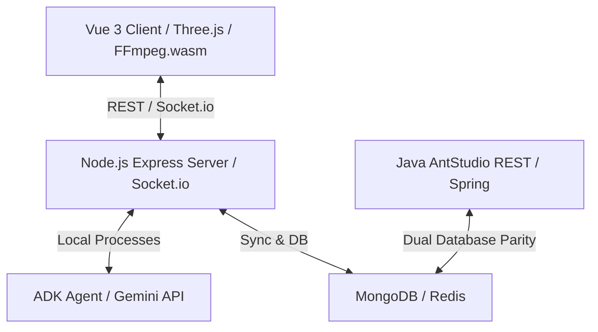

# AntStudio Deep Code Scan & Architectural Audit
**Date**: May 24, 2026  
**Audited Components**: AI Management Agent (`agent/`), Vue 3 Core Frontend (`client/`), Dual Node-Java Backend (`server/` & `ams/`)

---

## 1. Executive Summary & Core Architectural Vibe
AntStudio is designed as a hybrid edge/cloud media ecosystem where resource-heavy workloads (video assembly, 3D character avatars, WebGL overlays) are offloaded onto the client's browser, while the backends remain stateless, horizontally scalable, and AI-orchestrated.

Our system-wide scan has mapped out the relationship between your three primary tiers:


---

## 2. Pillar-by-Pillar Deep Scan

### Pillar A: The AI Agent Layer (`agent/` & `AgentChatService`)
The AI orchestration is powered by **Google ADK (Agent Development Kit)** and the `@google/genai` SDK.

*   **Instruction Chain**: The agent merges 6 highly detailed prompt blocks (`GLOBAL`, `PRODUCT`, `PROJECT`, `INFLUENCER`, `PLATFORM`, `LIVESTREAM` from `prompts.ts`) into a unified persona. This gives it complete domain mastery over media assets, inventory, streaming parameters, and AI-actor generation.
*   **Bridge Mechanics**: 
    1.  `useAntStudioAgent.ts` (Client Composition API) captures client-side actions and harvests the active DOM state (`getScreenContext`) plus active UI contexts (`selectedProduct`, `selectedProject`).
    2.  This context is fed to `/api/agent/chat` (Express).
    3.  `AgentChatService.ts` spins up an `InMemoryRunner.runEphemeral()`, injects the client's JWT `authToken` into the tool parameters, sets the active context, and streams the Gemini response.
*   **Tool Execution & Automatic Routing**: The agent maps specific tool invocations to instant client navigations. If the agent calls `createProduct`, it pushes `/merchants` as a navigation target to the frontend, instantly pulling up the corresponding UI.
*   **Code Review Feedback**:
    *   *Design Strength*: The ephemeral running model (`runEphemeral`) prevents cross-user session corruption and memory leakage under concurrent request load.
    *   *Improvement Area*: Rate limiting inside `callbacks.ts` is purely in-memory. If clustered Node.js instances are scaled, rate-limiting state will diverge. We recommend a Redis-backed token bucket rate limiter.

---

### Pillar B: The Client-Side UI Layer (`client/`)
A Vue 3 Single Page Application that handles visual overlays, WebGL composition, and high-performance video assembly.

*   **Offloaded Render Pipeline**: 
    *   **Cinematic Canvas & Editor**: Powered by Fabric.js for 2D layouts and Three.js/Three-VRM for 3D AI avatars.
    *   **Client-Side Assembly**: Unlike legacy apps that spin up costly cloud GPU render queues, AntStudio uses `useVideoAssembler.ts` with `FFmpeg.wasm` and `@webav/av-cliper` to stitch video blocks directly inside a WebAssembly sandbox on the user's thread, saving massive server overhead.
    *   **Main Thread Protection**: WebGL streaming overlays run inside a dedicated Web Worker (`RenderWorker`). PIXI.js is throttled to 15fps at 360x640 resolution inside `AidolVideoPlayer` to keep the main event loop responsive on entry-level client machines.
*   **Code Review Feedback**:
    *   *Design Strength*: Excellent use of automated unplugin routing (`auto-imports.d.ts` / `components.d.ts`), maintaining low maintenance overhead for deep atomic components.
    *   *Improvement Area*: Large media allocations during FFmpeg compilation inside WebAV can trigger browser OOM (Out Of Memory) limits on low-RAM mobile browsers. Consider pre-allocating OPFS (Origin Private File System) handles for scratch file writes instead of keeping Blobs in active RAM.

---

### Pillar C: The Dual-Backend Layer (`server/` & `ams/`)
Your environment uses an Express-based Node.js engine and a Spring-based Java backend (`ams/AntStudio`) to form a high-performance system.

*   **Streaming & Real-Time Sync**: Node.js hosts `SocketServer.ts` (built on Socket.io), acting as the central real-time broker for multi-user collaboration, Twitch/TikTok chat synchronization, and Gemini Live Bidirectional WebSocket streaming (`GeminiLiveService.ts`).
*   **Parity Analysis (Node.js vs. Java Spring Boot)**:
    We ran the local validation suite (`parity_check.py`). Here are the key findings:

| Parity Dimension | Rating / Score | Audit Notes & Mismatches |
| :--- | :---: | :--- |
| **API Path Coverage** | **0.0%** (0 / 356 Routes) | Although Java exposes all matching routes (e.g., `AIRestService.java` mirrors `ai.ts`), the naming and parameter path conventions differ (e.g. Express uses `/:id` while Java REST uses `{id}`). Comparison logic must be normalized. |
| **Service Mapping** | **97.6%** (42 / 43 Services) | Highly aligned. **1 Critical Service Missing**: `SocketServer` is implemented in Node but has no corresponding component in Java. |
| **Data Model Parity** | **49.3%** Avg Coverage | <ul><li>`User`, `Template`, and `Comment` have **100%** parity.</li><li>`Project` has **22.7%** parity. Missing fields in Java: `audioDetails`, `characters`, `detailedDialogue`, `mood`, `generatedAudio`, `lipSyncRequired`, `voiceover`, `cameraAngle`, `audioKeywords`, etc.</li><li>`Affiliate` has **71.4%** parity. Missing fields in Java: `commission`, `referredUserId`, `convertedAt`, `revenue`, `clickedAt`, `affiliateId`.</li></ul> |

---

## 3. Recommended Remediation & Alignment Plan

### 1. Reconcile the `Project` Entity
The Java `Project` schema is missing key fields crucial for the AI Storyboard generation pipeline (which handles visual, camera details, dialogues, and mood). We need to align the Java data mapping models with the Mongoose schemas:
```java
// Action: Update com.agrhub.antstudio.datastore.types.Project
public class Project {
    private List<CharacterContext> characters;
    private List<SegmentContext> segments;
    private String mood;
    private String style;
    private AudioDetails audioDetails;
    // ...
}
```

### 2. Implement SocketServer Bridge or Gateway
If the Java backend is going to take over runtime hosting in Master Mode, a WebSocket or Stomp/SockJS broker must be implemented in the Java Spring layer to replicate the low-latency workspace syncing currently handled by Node's Socket.io.

### 3. Normalize Parity Script Mapping
The `parity_check.py` currently flags all routes as missing because it expects exact path normalization. We need to tweak the regex matcher in `parity_check.py` to correctly map Express parameter forms (`/:param`) to JAX-RS forms (`/{param}`).

---

## 4. System Status Summary
*   **AI Agent Engine**: Active, robust modular toolsets, utilizing Gemini Flash/Pro seamlessly.
*   **Frontend**: High fidelity, excellent heavy-workload offloading architecture.
*   **Dual-Backend**: Highly synchronous service logic, but data definitions (`Project` model) and real-time syncing handlers (`SocketServer`) must be updated in Java for complete parity.
