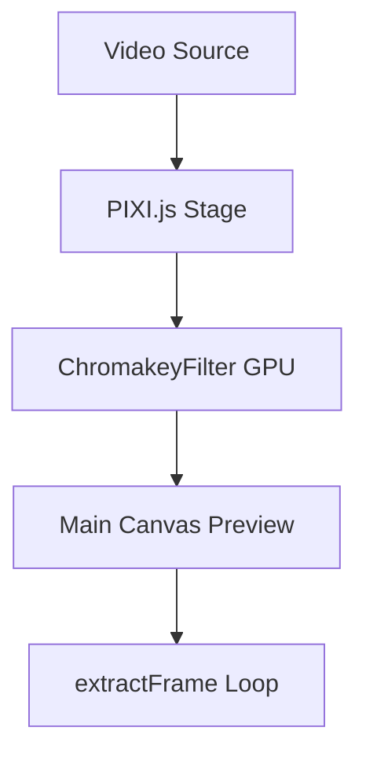
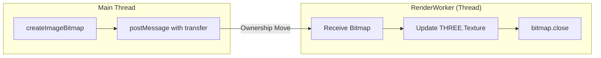

# AI Rendering & Chromakey Architecture

This document explains the unified workflow for processing AI influencers in AntStudio, designed to eliminate duplication and minimize CPU/Memory overhead.

---

## 1. Frame Processing Flow (Source -> Preview)

For video-based influencers (`VideoViewer`, `AidolVideoPlayer`), the pipeline is as follows:

1.  **PIXI Stage**: Instead of raw `<canvas>` draws, we use PIXI.js to leverage the GPU for compositing and filters.
2.  **ChromakeyFilter**: A high-performance Fragment Shader performs background removal, spill suppression, and edge smoothing in a single GPU pass.
3.  **Throttling**: The main preview renders at 30 FPS to save CPU, compared to the un-throttled 60+ FPS previously found in `AidolVideoPlayer`.

---

## 2. Broadcast Data Flow (Main Thread -> Worker)

To ensure the "Program Feed" (broadcast/record) is identical to the preview without double-processing, we use a **Zero-Copy Transfer** mechanism.

-   **Zero-Copy**: By passing the `ImageBitmap` in the second argument of `postMessage`, we "transfer" the memory pointer rather than cloning the data. This drops memory usage from GBs to MBs.
-   **Explicit Closure**: `bitmap.close()` is called in the worker immediately after the texture upload to ensure the GPU memory is recycled.

---

## 3. Consolidation Key Points

1.  **Eliminated [ChromakeyProcessor.ts](file:///d:/Workspace/Gits/CamHub/ams/AntStudio/client/src/utils/ai/ChromakeyProcessor.ts)**: This module created a secondary WebGL context that competed for resources. It is now replaced by the [ChromakeyFilter](file:///d:/Workspace/Gits/CamHub/ams/AntStudio/client/src/components/influencer/VideoViewer.vue#149-191) used inside PIXI.
2.  **Unified Dispatch**: Both `VideoViewer` and `AidolVideoPlayer` now use a shared dispatch rhythm, preventing multiple components from flooding the worker with the same frames.
3.  **Active-Only Policy**: Rendering loops and AI Workers ([LiveAIEngine](file:///d:/Workspace/Gits/CamHub/ams/AntStudio/client/src/utils/ai/LiveAIEngine.ts#19-196)) are only initialized when the model is visible and active. Switching to a non-AI model (like VRM) aggressively terminates tracking workers.

---

## 4. Troubleshooting Hierarchy

If rendering performance degrades, check in this order:
1.  **Multiple Contexts**: Ensure only one PIXI instance is active per guest.
2.  **Transfer Failures**: Verify `studio-worker-command` is being swallowed by [useStudioCanvas](file:///d:/Workspace/Gits/CamHub/ams/AntStudio/client/src/composables/studio/useStudioCanvas.ts#15-1351) and correctly passed to the worker.
3.  **Resolution Oversampling**: Frames are capped at 1080p (or lower for AI tracking) to prevent GPU saturation.
