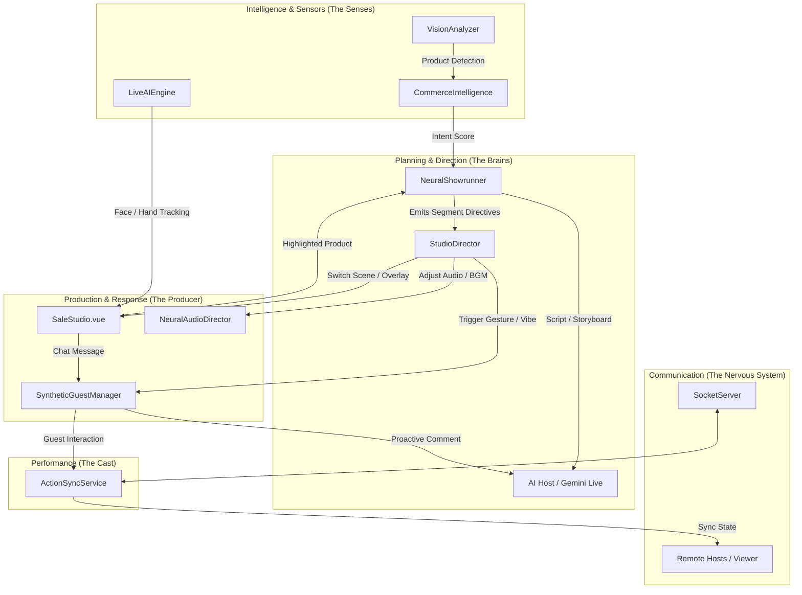

# SaleStudio AI Service Architecture & Flow

This document outlines how the various AI services within `client/src/utils/ai` interact to orchestrate a live show in `SaleStudio`.

## Technical Architecture Diagram

## Service Role Definitions

### 1. The Orchestrators (Decision Makers)
*   **`NeuralShowrunner.ts` (The Show Planner)**:
    *   **Role**: High-level narrative control.
    *   **Workflow**: It creates a session plan (Segments like Intro, Product Pitch, Q&A, Recap). It "ticks" every second and tells the studio what *type* of content is happening right now.
    *   **Interaction**: It prioritizes the `SaleWizard` storyboard if available.

*   **`StudioDirector.ts` (The Producer)**:
    *   **Role**: Tactical production actions ("God Mode").
    *   **Workflow**: It monitors real-time sensors (is anyone talking? is the chat moving fast?).
    *   **Actions**: It autonomously switches camera layouts (standard, PIP, grid), triggers celebrations (confetti), and shows lower-third overlays.

*   **`SyntheticGuestManager.ts` (The Cast Manager)**:
    *   **Role**: Manages AI "Guests".
    *   **Workflow**: It gives guests "Agency" to chime in, ask questions, or react to the host's pitch. It ensures the show feels like a conversation, not a monologue.

### 2. The Intelligence Layer (Sensors)
*   **`CommerceIntelligenceEngine.ts`**: Analyzes chat and vision data to calculate a "Buying Intent Score". When high, it signals the `StudioDirector` to trigger a "Call to Action".
*   **`LiveAIEngine.ts`**: Handles heavy-duty Computer Vision (Face/Hand tracking) in a background worker.
*   **`VisionCommerceService.ts`**: Uses AI to "see" what is on the host's desk or camera and automatically highlights the matching product in the store.

### 3. The Infrastructure (Glue)
*   **`ActionSyncService.ts`**: The WebSocket bridge. If you have a co-host or a remote guest, this service ensures that when *you* switch a scene, *they* see it too.
*   **`NeuralAudioDirector.ts`**: The "DJ". It handles background music, ducking (lowering music when someone speaks), and ambient soundscapes.

## The Standard Workflow (The "Tick")

1.  **Clock**: `NeuralShowrunner` beats every 1 second.
2.  **Directives**: Every segment, it sends a `Directive` to the AI Host.
3.  **Agency**: `StudioDirector` checks the "Vibe". If the Host is silent for too long, it might trigger a Guest to ask a question.
4.  **Sync**: Any UI change (Scene Switch, Product Highlight) is broadcasted via `ActionSyncService` to all connected participants.

## Common Confusion & Overlaps

> [!NOTE]
> **Showrunner vs. Director**:
> - The **Showrunner** thinks about **TIME** and **NARRATIVE** (e.g., "We are in the 5-minute Intro phase").
> - The **Director** thinks about **VISUALS** and **PRODUCTION** (e.g., "The Host is talking loud, let's switch to Full Screen").

> [!NOTE]
> **ActionSync vs. SocketServer**:
> - `SocketServer` is the backend relay.
> - `ActionSyncService` is the client-side manager that organizes those socket events into high-level actions (Update Layer, Sync Guest).
