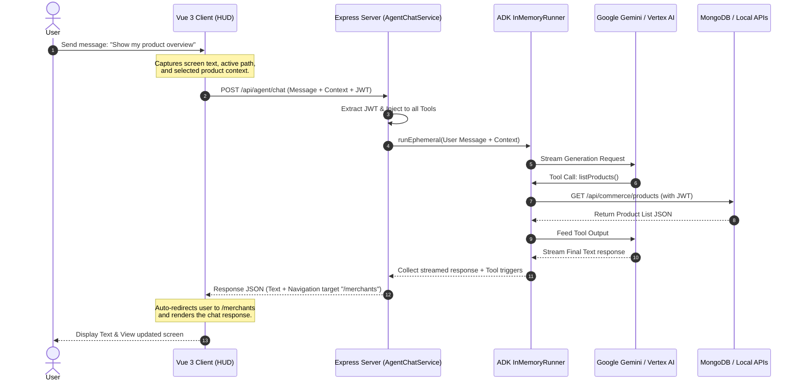

# Google Cloud AI Agent (ADK) Integration Guide

AntStudio integrates a fully autonomous, context-aware AI management agent built on the **Google Agent Development Kit (ADK)** and powered by **Google Gemini**. The agent can manage products, organize video projects, direct virtual avatars, control live streams, and query business analytics through simple conversation.

This guide provides a comprehensive breakdown of the agent's architecture, tools, backend bridge, and advanced coordination features.

---

## 🏗️ Architecture Overview

The integration spans the entire AntStudio stack in a three-tiered architecture:



### 📂 Directory Layout
- **Agent Entry & Dev Bootstrapper**: `agent/agent.ts` - Boots servers and exports the `rootAgent`.
- **System Instructions**: `agent/prompts.ts` - Contextual persona prompts (Global, Product, Live, Platform).
- **Core Tools**: `agent/tools/` - Definitions for over 40+ distinct REST-mapped capabilities.
- **Express Backend Bridge**: `server/src/services/AgentChatService.ts` - Session lifecycle, token delegation, and context aggregation.
- **Frontend Interaction HUD**: `client/src/components/agent/` - Slide-out floating chat bubble and screen scraping script.

---

## 🔒 Security & Auth Token Delegation

A primary design constraint is that **all tool actions executed by the agent must respect the user's secure permissions**. Instead of using a master admin API key, AntStudio employs a **Dynamic Delegation** pattern:

1. The client sends the request to Express with the standard `Authorization: Bearer <JWT>` header.
2. The `tenantMiddleware` and `authMiddleware` authenticate the user and isolate their tenant scope.
3. In `AgentChatService.ts`, prior to initiating the agent run, the user's JWT is dynamically injected into all tools using `setAllAuthTokens(authToken)`.
4. When a tool (e.g., `listProducts`) executes a REST fetch via `apiCall()`, it injects this token into the `Authorization` header:

```typescript
// agent/tools/product.tools.ts
let _authToken: string = '';
export function setAuthToken(token: string) { _authToken = token; }

export async function apiCall(method: string, path: string, body?: any, token?: string) {
    const fetch = (await import('node-fetch')).default;
    const headers: Record<string, string> = { 'Content-Type': 'application/json' };
    if (token) headers['Authorization'] = `Bearer ${token}`;

    const res = await fetch(`${config.ANTSTUDIO_API_URL}${path}`, {
        method,
        headers,
        body: body ? JSON.stringify(body) : undefined,
    });
    return await res.json();
}
```

> [!IMPORTANT]
> **Ephemeral Isolation**: The runner executes each turn in an isolated *ephemeral* context (`runEphemeral`), which clears credentials and transient variables after each request. This prevents token leakage across multi-tenant sessions.

---

## 🧭 Smart Navigation Redirection (Tool-to-Route)

To provide a cohesive user experience, the agent does not just "talk"—it interacts with the frontend application. 

When the agent decides to execute a tool, `AgentChatService` maps specific tool executions to target frontend routes. When the API response goes back to the client, the client automatically redirects the user to the correct screen.

### Automatic Mapping Configuration
```typescript
// server/src/services/AgentChatService.ts
const toolRouteMap: Record<string, string> = {
    'listProducts': '/merchants',
    'createProduct': '/merchants',
    'updateProduct': '/merchants',
    'deleteProduct': '/merchants',
    'listProjects': '/projects',
    'createProject': '/projects',
    'generateScript': '/projects',
    'analyzeProjectScript': '/projects',
    'generateStoryboard': '/projects',
    
    // Influencer / Avatar tools -> /influencer
    'listInfluencers': '/influencer',
    'getInfluencer': '/influencer',
    'updateInfluencer': '/influencer',
    'deleteInfluencer': '/influencer',
    'generateProductVideo': '/influencer',
    'getSalesPlaylist': '/influencer',
    
    // Live Studio / Live Stream tools -> /live/studio
    'listLiveSessions': '/live/studio',
    'getLiveSession': '/live/studio',
    'showProductInLive': '/live/studio',
    'switchLiveScene': '/live/studio',
    'sendMessageToStream': '/live/studio',
    'playAudioInStream': '/live/studio',
    'highlightComment': '/live/studio',
    'syncProjectInventory': '/live/studio',
    'triggerFlashSale': '/live/studio',
    
    // Platform Management tools -> /settings or /developer
    'listPlatforms': '/settings',
    'getPlatformAuthUrl': '/settings',
    'disconnectPlatform': '/settings',
    'getPlatformStats': '/settings',
    'listPlatformVideos': '/settings',
    'getLiveStreamInfo': '/settings',
};
```

If a user asks *"Create a project about cinematic drones,"* the agent calls `createProject()`. The backend intercepts this tool event, associates the `/projects` route, and passes the navigation target back to the Vue client, which automatically redirects the user to their Project Dashboard.

### Explicit Routing Tool
The agent is also equipped with a generic tool, `navigateTo(path: string)`, which allows it to manually steer the user to any part of the application (e.g. `/live/studio`, `/billing`, `/settings`) as needed.

---

## 🔎 Dynamic Screen Context Aggregator

The agent behaves like a virtual co-pilot because it has **vision**—it knows exactly what the user is looking at and typing in real-time. 

When a user opens the chat bubble, the Vue frontend compiles an **Expanded Screen Context Payload**:

1. **`currentPath`**: The exact Vue Router path coordinates (e.g., `/projects/editor/6653dfb2`).
2. **`selectedProduct`**: Any active product loaded in the client-side focus state on `/merchants`.
3. **`selectedProject`**: The active project loaded in the workspace on `/projects` or `/projects/editor/:id`.
4. **`selectedInfluencer`**: The active digital avatar selected on `/influencer`.
5. **`selectedLiveSession`**: The active livestream session state on `/live/studio`.
6. **`screenText`**: A calculated string representing all readable text content visible in the browser viewport (including open dialogs, forms, or menus).

This payload is appended as a structured system note inside the LLM prompt during each interaction:

```typescript
let contextNote = `(Note: The user is currently viewing the app screen at path: '${currentPath}'.`;
if (selectedProduct) {
    contextNote += ` The active selected product context is: ${JSON.stringify(selectedProduct)}.`;
}
if (selectedProject) {
    contextNote += ` The active selected project context is: ${JSON.stringify(selectedProject)}.`;
}
if (selectedInfluencer) {
    contextNote += ` The active selected influencer context is: ${JSON.stringify(selectedInfluencer)}.`;
}
if (selectedLiveSession) {
    contextNote += ` The active selected live session context is: ${JSON.stringify(selectedLiveSession)}.`;
}
if (screenText) {
    contextNote += ` The current visible text on their screen is: """${screenText}""".`;
}
contextNote += ` You can provide suggestions or use tools relevant to this screen context.)`;
```

### Context-Aware Scenario Examples:
- **User says**: *"Explain what I'm looking at"*
  - **Agent response**: Captures `screenText` containing credit summaries and explains their usage breakdown.
- **User says**: *"Lower the stock of this product by 5"*
  - **Agent response**: Sees `selectedProduct` in context, extracts its ID automatically, and calls `updateProduct({ productId, stock: current - 5 })` without requiring the user to type product details manually.
- **User says**: *"Analyze this script"*
  - **Agent response**: Captures the active project `selectedProject` from context and triggers `analyzeProjectScript({ projectId: selectedProject._id })` directly, skipping any lookup steps.

---

## 🌐 Multilingual Conversational Flow

AntStudio serves both global and domestic markets. The agent implements automatic **Language Isolation**:

- `detectLanguage(text)` scans the incoming query for Vietnamese accented characters and common words (e.g., `sản phẩm`, `dự án`).
- It flags the session as either `'en'` or `'vi'`.
- It appends a language constraint:
  `Please reply in the EXACT same language as the user's message above.`
- If the AI encounters a system crash or an empty generation, it serves a localized system error message (e.g., *"Xin lỗi, tôi không thể xử lý yêu cầu..."*).

---

## 🛠️ Configuration & Secrets

To activate the agent, configure the following variables in your `agent/.env` (and set them as Secrets in Google Cloud Run/GCP production):

```env
# Google Authentication (API Key or Vertex AI)
GOOGLE_API_KEY=your_gemini_api_key
# OR for Vertex AI Production
GOOGLE_CLOUD_PROJECT=your_gcp_project_id
GOOGLE_CLOUD_LOCATION=us-central1
GOOGLE_GENAI_USE_VERTEXAI=1

# Agent Settings
AGENT_MODEL=gemini-3.1-flash-lite
ANTSTUDIO_API_URL=https://localhost:3000

# Port mappings
SERVER_PORT=4000
CLIENT_PORT=3000
```
